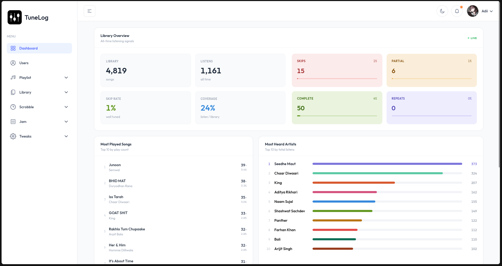

# Tunelog-Frontend : TLF

TLF is a frontend for my Open-sourced `Tunelog` project. This uses react and Typscript for the code base.
This is based on TailAdmin project. I have modified it to use it. 

---

---

# Overview

TLF provides a way to access the backend of tunelog to see the song stats, or create playlist and other config. 

# Installation

## Prerequisites